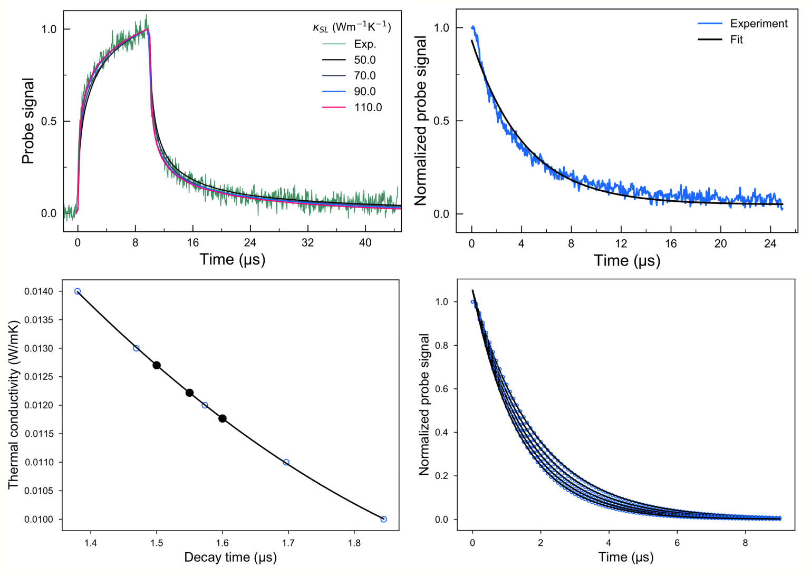

# TDTR Data Analysis

Repository for python codes used to analyse measured TDTR curves and extract the thermal conductivity from the measured decay times.

## Acknowledgments

These scripts have been developed in [Nomura lab](https://nlab.iis.u-tokyo.ac.jp/) at the University of Tokyo by [Roman Anufriev](https://anufrievroman.com/) in 2018 - 2023. See the following publications for more details:

- Anufriev et al. NPG Asia Materials 14, 35 (2022)
- Anufriev et al. ACS Nano 12, 11928 (2018)
- Anufriev et al. Nature Communications 8, 15505 (2017)
- Maire & Nomura, Japanese Journal of Applied Physics, 53, 06JE09 (2014)
