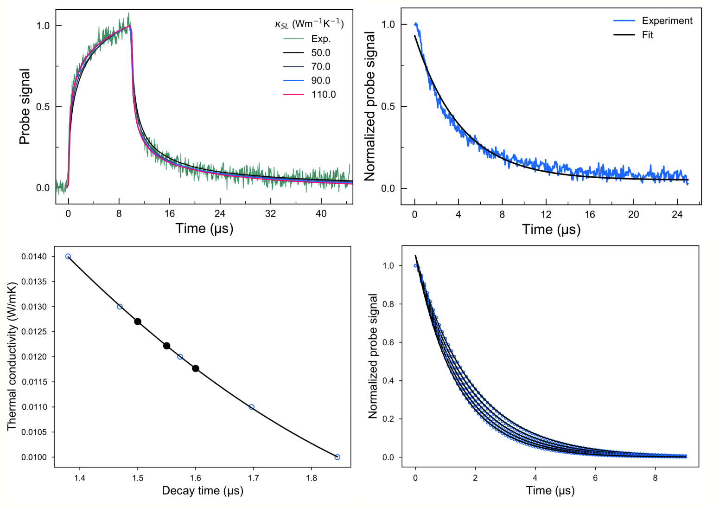

# TDTR Data Analysis
Repository for python codes used to analyse measured TDTR curves and extract the thermal conductivity from the measured decay times.

More details can be found in Anufriev et al. ACS Nano 2018, 12, 11928−11935
